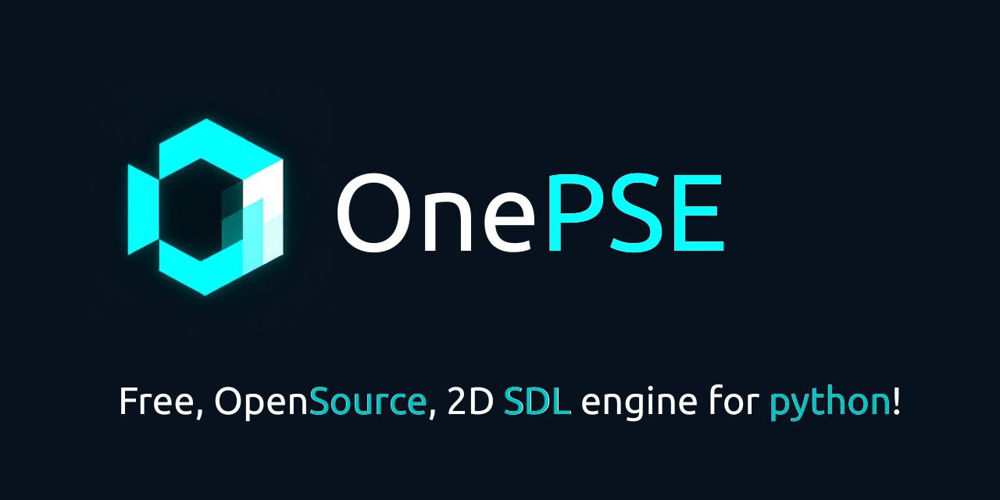

<h1 align="center"> <b>OnePSE</b> </h1>

<div align="center">
    
</div>

<h3 align="center"> <a href="READMEru.md" >Русский </a> || <a href="README.md"> English </a>

## Themes
- [About](#about)
- [Version and New Features](#version-000006-new-features)
- [Authors](#authors)
- [How to install](#how-to-install)
- - [Official Releases](#official-releases)
- - [GitHub Repo version](#from-github-repo)

## About

<b>OnePSE</b> is a free, open-source Python game engine using the SDL graphics engine.
This project is the work of two persons, so every star on Github is a huge incentive for its creator!

Initially, the project was conceived as a game on Sdl2, but soon, due to the complexity of Sdl2, this engine was born to simplify the work with this graphics engine.

This project is under active development. Therefore, it may receive lengthy but significant updates. We would be grateful if you contributed to the projec

## First alpha, not prototype!
## Version 0.0.0006 ([New Features](Added/AddedEn.md))

## Authors

| ![LREALLYCARFAMER] <h2>[ReallyCarFamer]</h2> <h3> 🎮Tester </h3> <h3> 12 Years</h3>| ![LCODCATDEV] <h2>[CodCatDev]</h2> <h3> 💻Programmer \| 🔧Creator</h3> <h3> 12 Years </h3>| ![LIILLUMINATION] <h2>[IILLUMINATION]</h2> <h3>🖌️Logo designer<h3> |
| :---: | :---: | :---: |

# How to install?
## Official releases
1. Open the [Releases](https://github.com/CodCatDev/OnePSE/releases) page
2. Select an release, you can select any of releases. but recomended select an releases with tag "Alpha/Beta/Release-Stable" (With suffix "Stable")
3. Download it. Select an file with version in name on release page.
4. Create a folder, and unpack archive to your folder.
5. Open it, and create a file with any name.
6. Check the folder. There should be your file and the "onepse" folder in the you folder.

If you did everything correctly, then continue following the instructions.

1. Open a "onepse" folder in a terminal.
2. Type in terminal:
```bash
pip install -r libs.txt
```
To install all libs
3. Close your terminal, and open your created file.
Done! You can write the code!
But, import a downloaded folder!
```python
import onepse
```

## From Github Repo
1. Install [Git](https://git-scm.com/downloads) (If you already install git, skip this step.)
2. Open terminal on any folder, and type
```bash
git clone https://github.com/CodCatDev/OnePSE.git
```
3. When it done, open an created from command folder. And done! You can edit "test.py", rename or create a new files in this directory and starting

[LCODCATDEV]: https://avatars.githubusercontent.com/u/192712551?s=150
[CodCatDev]: https://github.com/CodCatDev
[LREALLYCARFAMER]: https://avatars.githubusercontent.com/u/233435786?s=150
[ReallyCarFamer]: https://github.com/ReallyCarFamer
[LIILLUMINATION]: https://avatars.githubusercontent.com/u/197430084?s=150
[IILLUMINATION]: https://github.com/IILLUMINATION